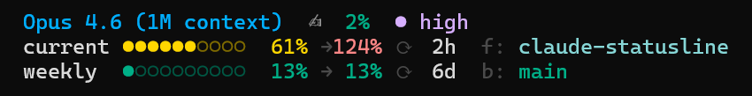

# claude-statusline (fork)

A customized Claude Code statusline showing rate limits, usage pacing, git info, and more.

This is a fork of [kamranahmedse/claude-statusline](https://github.com/kamranahmedse/claude-statusline) by [@kamranahmedse](https://github.com/kamranahmedse). Credit to him for the original project and idea. Our version has diverged with additional features (pace projections, peak hour indicators, session timers, etc.) and the two projects are maintained independently.



## Improvements over upstream

- **Pace projections** — projects your current/5h usage rate to end-of-window, so you can see if you're burning too fast before you hit a limit
- **Pace-aware coloring** — bar colors reflect projected usage, not just current percentage
- **Peak hours indicator** — flags weekday 8AM-2PM EDT as `peak` so you know when limits are tighter
- **Session timer** — shows how long the current Claude Code session has been running
- **Rate limits from stdin** — reads rate limit data from the CC input JSON instead of making a separate API call
- **Worktree support** — correctly shows branch and directory when running inside a git worktree
- **Fixed-width formatting** — percentages and projections use fixed widths to prevent layout shifts

## Install

The easiest way to install is to ask Claude Code to do it for you. Paste something like this into a conversation:

```
Review the statusline script at https://github.com/peterdrier/claude-statusline/blob/main/bin/statusline.sh
for security issues. If it looks safe, install it by:
1. Copying bin/statusline.sh to ~/.claude/statusline.sh
2. Making it executable (chmod +x)
3. Setting your Claude Code config (settings.json) to use it as the statusline
```

It's always a good idea to have Claude security-review any script before letting it install something into your environment. Better safe than sorry.

## Requirements

- [jq](https://jqlang.github.io/jq/) — for parsing JSON
- curl — for fetching rate limit data
- git — for branch info

On macOS:

```bash
brew install jq
```

On Debian/Ubuntu:

```bash
sudo apt install jq
```

## Uninstall

Remove `~/.claude/statusline.sh` and clear the `statusline` entry from your Claude Code `settings.json`.

## License

MIT
